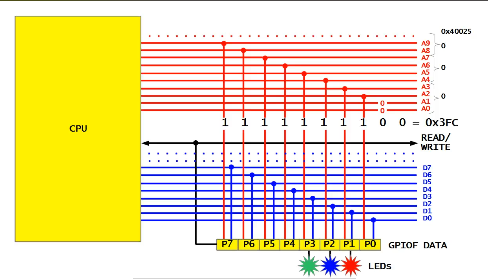

Для збереження данних за допомогою 1 операці процесора, використовується бітова маска яка дозволяє змінити тільки біти що вибрані для зміни інші не чипаюця(за допомогою харда). Тобто базовий адрес 0x40025 доповнюється значенням 8 біт регістра GPIO (0x00000000) + 2 біта (0x00) для коректності памяті що значить якщо ми хочемо виставити pins P1, P2, P3 треба 0001110 + 00 (hex = 0x38) повна адреса 0x40025038 дозваляє записати значення тільки цих pins без зчитування всіх пінів щоб залишити інші в поточному стані.

